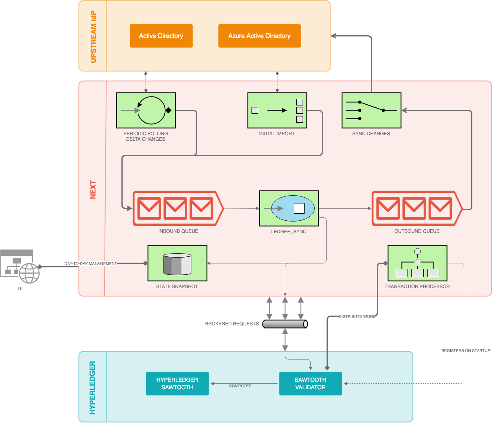
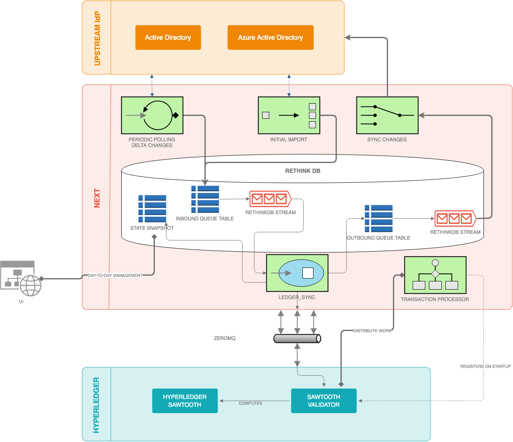

=================
NEXT Architecture
=================

Reference Architecture
======================
A very high-level view of the system

Technology Choices
==================
To fill in several of the above roles, we have adopted RethinkDB as our data storage engine. In addition to a
document storage interface, RethinkDB is unique in that every modification made to a table creates an entry
in a change stream. By leveraging this power, we can react to events asynchronously with stronger guarantees
than you can get in a traditional database without a two-phase commit between your database and message queue. 

Data Mapping
============
As you may expect, Active Directory and Azure Active Directory are very similar identity directories, but they do have some minor differences that must be accounted for. In addition, there are several fields that come back in responses from one provider and not another. 

To account for these differences and support the synchronization efforts of this project, we have to perform some basic field mapping from each provider into a standard NEXT field, then translate those differences correctly when making changes on the other provider. 

In the future, we expect this mapping to be customizable, but as of now it is a static mapping. 

***Any fields not explicitly listed here are not managed by NEXT, nor synchronized back to any upstream identity provider***.

User Fields

+---------------------+----------------------+---------------------+----------------------+-----------------------------+
|      AD Field       |   AD Field Xform     |     NEXT Field      |   AAD Field Xform    |       AAD Field             |
+=====================+======================+=====================+======================+=============================+
| objectGUID          |                      | user_id             |                      | id                          |
+---------------------+----------------------+---------------------+----------------------+-----------------------------+
| whenCreated         |                      | created_date        |                      | createdDateTime             |
+---------------------+----------------------+---------------------+----------------------+-----------------------------+
|                     |                      | deleted_date        |                      | deletedDateTime             |
+---------------------+----------------------+---------------------+----------------------+-----------------------------+
|                     |                      | account_enabled     |                      | accountEnabled              |
+---------------------+----------------------+---------------------+----------------------+-----------------------------+
| telephoneNumber     |                      | business_phones     |                      | businessPhones              |
+---------------------+----------------------+---------------------+----------------------+-----------------------------+
| company             |                      | company_name        |                      | companyName                 |
+---------------------+----------------------+---------------------+----------------------+-----------------------------+
| countryCode         |                      | country             |                      | country                     |
+---------------------+----------------------+---------------------+----------------------+-----------------------------+
|                     |                      | city                |                      | city                        |
+---------------------+----------------------+---------------------+----------------------+-----------------------------+
|                     |                      | office_location     |                      | officeLocation              |
+---------------------+----------------------+---------------------+----------------------+-----------------------------+
|                     |                      | postal_code         |                      | postalCode                  |
+---------------------+----------------------+---------------------+----------------------+-----------------------------+
|                     |                      | state               |                      | state                       |
+---------------------+----------------------+---------------------+----------------------+-----------------------------+
| countryCode         |                      | country             |                      | country                     |
+---------------------+----------------------+---------------------+----------------------+-----------------------------+
| department          |                      | department          |                      | department                  |
+---------------------+----------------------+---------------------+----------------------+-----------------------------+
| memberOf            |                      | member_of           |                      |                             |
+---------------------+----------------------+---------------------+----------------------+-----------------------------+
| displayName         |                      | name                |                      | displayName                 |
+---------------------+----------------------+---------------------+----------------------+-----------------------------+
| employeeID          |                      | employee_id         |                      | employeeId                  |
+---------------------+----------------------+---------------------+----------------------+-----------------------------+
| givenName           |                      | given_name          |                      | givenName                   |
+---------------------+----------------------+---------------------+----------------------+-----------------------------+
| title               |                      | job_title           |                      | jobTitle                    |
+---------------------+----------------------+---------------------+----------------------+-----------------------------+
| mail                |                      | email               |                      | mail                        |
+---------------------+----------------------+---------------------+----------------------+-----------------------------+
| cn                  |                      | user_nickname       |                      | mailNickname                |
+---------------------+----------------------+---------------------+----------------------+-----------------------------+
| manager             |                      | manager             |                      | manager                     |
+---------------------+----------------------+---------------------+----------------------+-----------------------------+
| mobilePhone         |                      | mobile_phone        |                      | mobilePhone                 |
+---------------------+----------------------+---------------------+----------------------+-----------------------------+
| distinguishedName   |                      | distinguished_name  |                      | onPremisesDistinguishedName |
+---------------------+----------------------+---------------------+----------------------+-----------------------------+
| preferredLanguage   |                      | preferred_language  |                      | preferredLanguage           |
+---------------------+----------------------+---------------------+----------------------+-----------------------------+
| streetAddress       |                      | street_address      |                      | streetAddress               |
+---------------------+----------------------+---------------------+----------------------+-----------------------------+
|                     |                      | surname             |                      | surname                     |
+---------------------+----------------------+---------------------+----------------------+-----------------------------+
|                     |                      | usage_location      |                      | usageLocation               |
+---------------------+----------------------+---------------------+----------------------+-----------------------------+
| userPrincipalName   |                      | user_principal_name |                      | userPrincipalName           |
+---------------------+----------------------+---------------------+----------------------+-----------------------------+
|                     |                      | user_type           |                      | userType                    |
+---------------------+----------------------+---------------------+----------------------+-----------------------------+

---

Group Fields

+---------------------+----------------------+---------------------+----------------------+----------------------+
|      AD Field       |   AD Field Xform     |     NEXT Field      |   AAD Field Xform    |       AAD Field      |
+=====================+======================+=====================+======================+======================+
| objectGUID          |                      | role_id             |                      | id                   |
+---------------------+----------------------+---------------------+----------------------+----------------------+
| whenChanged         |                      | created_date        |                      | createdDateTime      |
+---------------------+----------------------+---------------------+----------------------+----------------------+
|                     |                      | deleted_date        |                      | deletedDateTime      |
+---------------------+----------------------+---------------------+----------------------+----------------------+
|                     |                      | classification      |                      | classification       |
+---------------------+----------------------+---------------------+----------------------+----------------------+
| description         |                      | description         |                      | description          |
+---------------------+----------------------+---------------------+----------------------+----------------------+
| name                |                      | name                |                      | displayName          |
+---------------------+----------------------+---------------------+----------------------+----------------------+
| groupType           |                      | group_types         |                      | groupTypes           |
+---------------------+----------------------+---------------------+----------------------+----------------------+
|                     |                      | group_nickname      |                      | mailNickname         |
+---------------------+----------------------+---------------------+----------------------+----------------------+
|                     |                      | mail_enabled        |                      | mailEnabled          |
+---------------------+----------------------+---------------------+----------------------+----------------------+
| member              |                      | members             |                      | members              |
+---------------------+----------------------+---------------------+----------------------+----------------------+
| managedBy           |                      | owners              |                      | owners               |
+---------------------+----------------------+---------------------+----------------------+----------------------+
|                     |                      | security_enabled    |                      | securityEnabled      |
+---------------------+----------------------+---------------------+----------------------+----------------------+
|                     |                      | visibility          |                      | visibility           |
+---------------------+----------------------+---------------------+----------------------+----------------------+

Blockchain Storage
==================

The underlying distributed ledger (aka Blockchain) implementation we're using
is Sawtooth Hyperledger. The generic model of this ledger is a key-value store
with an address key indexing to an opaque string. This string is most often a
base-64 encoded serialized string. pt. 

Applications that work with the Sawtooth platform must determine how to index 
their data and keys. The specification from Sawtooth:

We have chosen to encode our addresses in the following manner:

+---------------------+----------------------+---------------------+-------------------------+
|  Bytes              |  Purpose             |  Example            |  Extra                  |
+=====================+======================+=====================+=========================+
| 0-2 (3 Bytes)       | Namespace            | role_id             | Always 'bac001', UTF-8  |
+---------------------+----------------------+---------------------+-------------------------+
| 3-4 (2 Bytes)       | Reserved             | 0x0000              | Reserved by System      |
+---------------------+----------------------+---------------------+-------------------------+
| 5-6 (2 Bytes)       | Object Type          | 0x4444 (Proposal)   | Enum in address_space.py|
+---------------------+----------------------+---------------------+-------------------------+
| 7-18 (12 Bytes)     | Object ID Hash       | 0xE8A76745B898A9C76 | We generate this hash   |
+---------------------+----------------------+---------------------+-------------------------+
| 19-20 (2 Bytes)     | Related Object Type  | 0x5555 (Role)       | Enum in address_space.py|
+---------------------+----------------------+---------------------+-------------------------+
| 21 (1 Byte)         | Relationship Type    | 0x88 (Manager)      | Enum in address_space.py|
+---------------------+----------------------+---------------------+-------------------------+
| 22-33 (12 Bytes)    | Related Obj ID Hash  | 0xFFFFFF45B898A9CFF | All 0-byte for 'None'   |
+---------------------+----------------------+---------------------+-------------------------+
| 34 (1 Byte)         | Reserved             | 0x00                | Reserved by System      |
+---------------------+----------------------+---------------------+-------------------------+

Given this scheme, we can refer to entries as a tuple:

.. code::

   Address ~= (ObjectType, ObjectId, RelationshipType, RelatedType, RelatedId)

This reads a bit like a sentence: User<X> is <a member of> Role<Y>. Given that
we are storing this in (essentially) a key-value store, this data structure
gives us something akin to an adjacency list.

Domain Concepts
===============

.. csv-table:: Domain Objects
   :header: "Code", "Object", "Purpose"
   :widths: auto

    "00", "None", "This represents a null object."
    "20", "SysAdmin", "A super-user that can perform administrative tasks"
    "30", "User", "A User is an entity representing an individual or service account"
    "40", "Proposal", "Encapsulates request to modify permissions"
    "50", "Role", "A Role maintains a list of Users assigned to that Role, as well as a list of Tasks that members are authorized for"
    "60", "Task", "A Task is an individual unit of Permission"
    "70", "Email", "Email-type object"
    "80", "Key", "Users' Public Key(s)"
    "90", "UUID", "Not sure"

.. csv-table:: Relationships
   :header: "Code", "Relationship", "Purpose"
   :widths: auto

    "00", "None", "This represents a null relationship."
    "10", "Attributes", "Deprecated; Being removed"
    "20", "Member", "RelatedId is a member of ObjectId"
    "30", "Owner", "RelatedId is owner of ObjectId"
    "40", "Admin", "RelatedId is an admin of ObjectId"
    "50", "Manager", "RelatedId is the manager of ObjectId"
    "60", "Direct Report", "RelatedID is a direct report of ObjectId"

.. csv-table:: Message Action Type
   :header: "Code", "Relationship", "Purpose"
   :widths: auto

    "0", "None", "This represents a null action type"
    "1", "Create", "Message wants to create object"
    "2", "Update", "Message wants to update object"
    "3", "Delete", "Message wants to delete object"
    "4", "Add", "Message wants to add item to collection"
    "5", "Remove", "Message wants to remove item from collection"
    "6", "Imports", "???"
    "10", "Propose", "Propose message (???)"
    "11", "Confirm", "Confirm message (???)"
    "12", "Reject", "Reject message (???)"

.. csv-table:: Messages
   :header: "NEXT Message",        "ActionType", "SubActionType", "AddressType",      "ObjectType", "RelatedType", "RelationshipType", "Description"
   :widths: auto

    "ADD_KEY",                     "Add",        "None",          "Key",              "Key",        "None",        "None",             ""
    "CONFIRM_ADD_ROLE_ADMIN",      "Confirm",    "Add",           "Proposals",        "Role",       "User",        "Admin",            ""
    "CONFIRM_ADD_ROLE_MEMBER",     "Confirm",    "Add",           "Proposals",        "Role",       "User",        "Member",           ""
    "CONFIRM_ADD_ROLE_OWNER",      "Confirm",    "Add",           "Proposals",        "Role",       "User",        "Owner",            ""
    "CONFIRM_ADD_ROLE_TASK",       "Confirm",    "Add",           "Proposals",        "Role",       "Task",        "Member",           ""
    "IMPORTS_ROLE",                "Imports",    "None",          "Roles_Attributes", "Role",       "None",        "Attributes",       ""
    "PROPOSE_ADD_ROLE_ADMIN",      "Propose",    "Add",           "Proposals",        "Role",       "User",        "Admin",            ""
    "PROPOSE_ADD_ROLE_MEMBER",     "Propose",    "Add",           "Proposals",        "Role",       "User",        "Member",           ""
    "PROPOSE_ADD_ROLE_OWNER",      "Propose",    "Add",           "Proposals",        "Role",       "User",        "Owner",            ""
    "PROPOSE_ADD_ROLE_TASK",       "Propose",    "Add",           "Proposals",        "Role",       "Task",        "Member",           ""
    "REJECT_ADD_ROLE_ADMIN",       "Reject",     "Add",           "Proposals",        "Role",       "User",        "Admin",            ""
    "REJECT_ADD_ROLE_MEMBER",      "Reject",     "Add",           "Proposals",        "Role",       "User",        "Member",           ""
    "REJECT_ADD_ROLE_OWNER",       "Reject",     "Add",           "Proposals",        "Role",       "User",        "Owner",            ""
    "REJECT_ADD_ROLE_TASK",        "Reject",     "Add",           "Proposals",        "Role",       "Task",        "Member",           ""
    "CONFIRM_ADD_TASK_ADMIN",      "Confirm",    "Add",           "Proposals",        "Task",       "User",        "Admin",            ""
    "CONFIRM_ADD_TASK_OWNER",      "Confirm",    "Add",           "Proposals",        "Task",       "User",        "Owner",            ""
    "CREATE_TASK",                 "Create",     "None",          "Tasks_Attributes", "Task",       "None",        "Attributes",       ""
    "PROPOSE_ADD_TASK_ADMIN",      "Propose",    "Add",           "Proposals",        "Task",       "User",        "Admin",            ""
    "PROPOSE_ADD_TASK_OWNER",      "Propose",    "Add",           "Proposals",        "Task",       "User",        "Owner",            ""
    "REJECT_ADD_TASK_ADMIN",       "Reject",     "Add",           "Proposals",        "Task",       "User",        "Admin",            ""
    "REJECT_ADD_TASK_OWNER",       "Reject",     "Add",           "Proposals",        "Task",       "User",        "Owner",            ""
    "CONFIRM_UPDATE_USER_MANAGER", "Confirm",    "Update",        "Proposals",        "User",       "User",        "Manager",          ""
    "CREATE_USER",                 "Create",     "None",          "User",             "User",       "None",        "Attributes",       ""
    "PROPOSE_UPDATE_USER_MANAGER", "Propose",    "Update",        "Proposals",        "User",       "User",        "Manager",          ""
    "REJECT_UPDATE_USER_MANAGER",  "Reject",     "Update",        "Proposals",        "User",       "User",        "Manager",          ""

