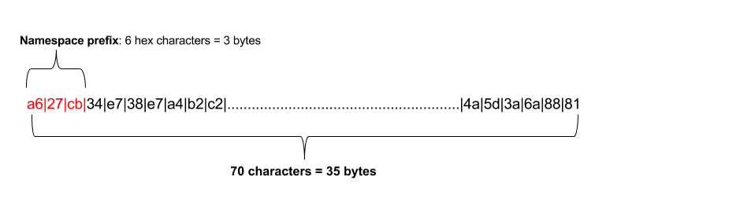

=================
NEXT Architecture
=================

NEXT is composed of two core features. The first is a blockchain-based
Role-Based Access Control (RBAC) system. This system managers users and groups
and the permissions they are granted. We utilize the Sawtooth blockchain
back-end to store every change made to the system with a complete audit trail
and history. Any change to the system, such as adding a user to a group, is
done through a proposal system. A membership addition is proposed. Managers
and Group owners/admins can approve or reject these proposals. 

The second feature is a bi-directional synchronization between Active Directory
(AD) and Azure Active Directory (AAD). Changes made in AD or AAD are mirrored
in the NEXT system, then propagated to the other identity system.

Reference Architecture
======================
A very high-level view of the system

.. figure:: _static/reference-architecture-1.png
    :width: 1000px
    :align: center
    :alt: Reference Architecture
    :figclass: align-center

Technology Choices
==================
To fill in several of the above roles, we have adopted RethinkDB as our
data storage engine. In addition to a document storage interface, RethinkDB
is unique in that every modification made to a table creates an entry in a
change stream. By leveraging this power, we can react to events asynchronously
with stronger guarantees than you can get in a traditional database without
a two-phase commit between your database and message queue.

RBAC System
===========

Domain Concepts
---------------
The workflow of this system is a proposal-based asynchronous messaging
platform. Messages propose changes to the global state, and then are
confirmed or rejected by others with the appropriate permissions.

The core domain objects:

.. csv-table:: Domain Objects
   :header: "Object", "Purpose"
   :widths: auto

    "SysAdmin", "A special NEXT system administrator role"
    "User",     "A User is an entity representing an individual or service account"
    "Proposal", "Encapsulates request to modify permissions"
    "Role",     "A Role maintains a list of Users assigned to that Role, as well as a list of Tasks that members are authorized for"
    "Task",     "A Task is an individual unit of Permission"
    "Email",    "Email-type object"
    "Key",      "Users' Public Key(s)"

Roles and Tasks can have Owners, Admins, and Members. Roles can additionally
have Tasks.

.. csv-table:: Role and Task Admin/Owner/Member
   :header: "RoleType", "Purpose"
   :widths: auto

    "Admin",  "Implies Owner; Can add/remove Owners and Admins"
    "Member", "User is a member of role/task for authorization purposes"
    "Owner",  "Implies Member; Can approve/reject/modify membership"
    "Task",   "Role only; A permission granted to members of this group"

Changes to the global state are done through proposals in a message queue. A
proposal gets created and placed in the queue. The system then determines
who an approve and reject that proposal. The proposal itself is stored in
the blockchain according to the below section, "Blockchain Storage". The
payload protobuf contains the list of approvers and rejecters.

Blockchain Storage
------------------

The underlying distributed ledger (aka Blockchain) implementation we're using
is Sawtooth. The generic model of this ledger is a key-value store
with an address key indexing to an opaque string. This string is a serialized
and compressed protobuf. 

Applications that work with the Sawtooth platform must determine how to index
their data and keys. Sawtooth gives the following specification:

Given this, we have chosen to address our data like so:

+---------------------+----------------------+---------------------+-------------------------+
|  Bytes              |  Purpose             |  Example            |  Extra                  |
+=====================+======================+=====================+=========================+
| 0-2 (3 Bytes)       | Namespace            | 0xbac001            | Fixed value for NEXT    |
+---------------------+----------------------+---------------------+-------------------------+
| 3-4 (2 Bytes)       | Reserved             | 0x0000              | Always 0x0000; Reserved |
+---------------------+----------------------+---------------------+-------------------------+
| 5-6 (2 Bytes)       | Object Type          | 0x0028 (Proposal)   | See "Domain Objects"    |
+---------------------+----------------------+---------------------+-------------------------+
| 7-18 (12 Bytes)     | Object ID Hash       | 0x....abcd123456789 | We generate this hash   |
+---------------------+----------------------+---------------------+-------------------------+
| 19-20 (2 Bytes)     | Related Object Type  | 0x0032 (Role)       | See "Domain Objects"    |
+---------------------+----------------------+---------------------+-------------------------+
| 21 (1 Byte)         | Relationship Type    | 0x88 (Manager)      |                         |
+---------------------+----------------------+---------------------+-------------------------+
| 22-33 (12 Bytes)    | Related Obj ID Hash  | 0x....abcd123456789 | All 0-byte for 'None'   |
+---------------------+----------------------+---------------------+-------------------------+
| 34 (1 Byte)         | Reserved             | 0x00                | Always 0x00; Reserved   |
+---------------------+----------------------+---------------------+-------------------------+

Given this scheme, we can refer to entries as a tuple:

.. code::

   Address ~= (ObjectType, ObjectId, RelatedType, RelationshipType, RelatedId)

This reads a bit like a sentence: User<X> is <a member of> Role<Y>. Given that
we are storing this in (essentially) a key-value store, this data structure
gives us something akin to an adjacency list.

There are two parts to storage: the address and the payload. Some facts about
the state of the system can be checked by the mere presence of data at an
address. For example, a user's membership in a role can be validated by
requesting the tuple (Role, :code:`0x123...`, User, Member, :code:`0x456...`).

Messages are not persisted on the blockchain, but proposals are.
The primary structures stored on the blockchain include:

.. csv-table:: Addressing Types
    :header: "ObjectType", "RelatedType", "RelationshipType", "Purpose"
    :widths: auto

    "SysAdmin", "None", "Attributes", "A System Maintainer Role record"
    "User",     "None", "Attributes", "A User record"
    "Proposal", "None", "Attributes", "A Proposal record"
    "Role",     "None", "Attributes", "A Role record"
    "Task",     "None", "Attributes", "A Task record"
    "Email",    "None", "None",       "An Email record"
    "Key",      "None", "None",       "A User's Public/Private Key Record"

Notice the "RelatedType" is "None" for all of those. Relationships:

.. csv-table:: Addressing Relationships
   :header: "ObjectType", "RelatedObjectType", "RelationshipType", "Purpose"
   :widths: auto

    "SysAdmin", "User",  "Admin",        "User is an admin of SysAdmin Role"
    "SysAdmin", "User",  "Member",       "User is a member of SysAdmin role"
    "SysAdmin", "User",  "Owner",        "User is an owner of SysAdmin role"

    "User",     "Email", "Owner",        "User's Email Address"
    "User",     "Key",   "Owner",        "User's Keypair Information"
    "User",     "User",  "Manager",      "User2 is manager of User1"
    "User",     "User",  "DirectReport", "User2 is direct report of User1"

    "Role",     "User",  "Admin",        "User is an admin of Role"
    "Role",     "User",  "Member",       "User is a member of Role"
    "Role",     "User",  "Owner",        "User is an owner of Role"
    "Role",     "Task",  "Member",       "Task is a member of Role"

    "Task",     "User",  "Admin",        "User is an admin of Task"
    "Task",     "User",  "Owner",        "User is an owner of Task"

Examples
--------

Let's look at some examples of how the addressing works. First, let's see
what a user type looks like. The types:

+---------------------+----------------------+----------------------------+
|  Bytes              |  Purpose             |  Encoded Data              |
+=====================+======================+============================+
| 0-2 (3 Bytes)       | Namespace            | 0xbac001                   |
+---------------------+----------------------+----------------------------+
| 3-4 (2 Bytes)       | Reserved             | 0x0000                     |
+---------------------+----------------------+----------------------------+
| 5-6 (2 Bytes)       | User Object Type     | 0x001e (User)              |
+---------------------+----------------------+----------------------------+
| 7-18 (12 Bytes)     | Object ID Hash       | 0x0123456789abcdef01234567 |
+---------------------+----------------------+----------------------------+
| 19-20 (2 Bytes)     | Related Object Type  | 0x0000 (None)              |
+---------------------+----------------------+----------------------------+
| 21 (1 Byte)         | Relationship Type    | 0x0a (Attributes)          |
+---------------------+----------------------+----------------------------+
| 22-33 (12 Bytes)    | Related Obj ID Hash  | 0x000000000000000000000000 |
+---------------------+----------------------+----------------------------+
| 34 (1 Byte)         | Reserved             | 0x00                       |
+---------------------+----------------------+----------------------------+

So, the final address would be the concatenation of these bytes:

.. code::

    0xbac0010000001e0123456789abcdef0123456700000a00000000000000000000000000

Note that the number of characters is exactly 70, corresponding to 35 bytes

Now, let's look at an example relationship. Let's take the same user, but
encode a relationship with her manager. Filling in our table:

+---------------------+----------------------+----------------------------+
|  Bytes              |  Purpose             |  Encoded Data              |
+=====================+======================+============================+
| 0-2 (3 Bytes)       | Namespace            | 0xbac001                   |
+---------------------+----------------------+----------------------------+
| 3-4 (2 Bytes)       | Reserved             | 0x0000                     |
+---------------------+----------------------+----------------------------+
| 5-6 (2 Bytes)       | User Object Type     | 0x001e (User)              |
+---------------------+----------------------+----------------------------+
| 7-18 (12 Bytes)     | Object ID Hash       | 0x0123456789abcdef01234567 |
+---------------------+----------------------+----------------------------+
| 19-20 (2 Bytes)     | Related Object Type  | 0x001e (User)              |
+---------------------+----------------------+----------------------------+
| 21 (1 Byte)         | Relationship Type    | 0x32 (Manager)             |
+---------------------+----------------------+----------------------------+
| 22-33 (12 Bytes)    | Related Obj ID Hash  | 0xaaaa456789abcdef01234567 |
+---------------------+----------------------+----------------------------+
| 34 (1 Byte)         | Reserved             | 0x00                       |
+---------------------+----------------------+----------------------------+

So, the final address would be the concatenation of these bytes:

.. code::

    0xbac0010000001e0123456789abcdef01234567001e32aaaa456789abcdef0123456700

Note that, again, the number of characters is exactly 70, corresponding to
the allowed 35 bytes.

These are all *addresses* on the blockchain. The other part is the data
payload. Data is stored in serialized Protobufs according to the Protobuf
specification.

Active Directory Synchronization
================================
As you may expect, Active Directory and Azure Active Directory are very similar
identity directories, but they do have some minor differences that must be
accounted for. In addition, there are several fields that come back in
responses from one provider and not another.

To account for these differences and support the synchronization efforts of
this project, we have to perform some basic field mapping from each provider
into a standard NEXT field, then translate those differences correctly when
making changes on the other provider.

In the future, we expect this mapping to be customizable, but as of now it
is a static mapping.

**Any fields not explicitly listed here are not managed by NEXT, nor
synchronized back to any upstream identity provider**

User Fields

+---------------------+----------------------+---------------------+----------------------+-----------------------------+
|      AD Field       |   AD Field Xform     |     NEXT Field      |   AAD Field Xform    |       AAD Field             |
+=====================+======================+=====================+======================+=============================+
| objectGUID          |                      | user_id             |                      | id                          |
+---------------------+----------------------+---------------------+----------------------+-----------------------------+
| whenCreated         |                      | created_date        |                      | createdDateTime             |
+---------------------+----------------------+---------------------+----------------------+-----------------------------+
|                     |                      | deleted_date        |                      | deletedDateTime             |
+---------------------+----------------------+---------------------+----------------------+-----------------------------+
|                     |                      | account_enabled     |                      | accountEnabled              |
+---------------------+----------------------+---------------------+----------------------+-----------------------------+
| telephoneNumber     |                      | business_phones     |                      | businessPhones              |
+---------------------+----------------------+---------------------+----------------------+-----------------------------+
| company             |                      | company_name        |                      | companyName                 |
+---------------------+----------------------+---------------------+----------------------+-----------------------------+
| countryCode         |                      | country             |                      | country                     |
+---------------------+----------------------+---------------------+----------------------+-----------------------------+
|                     |                      | city                |                      | city                        |
+---------------------+----------------------+---------------------+----------------------+-----------------------------+
|                     |                      | office_location     |                      | officeLocation              |
+---------------------+----------------------+---------------------+----------------------+-----------------------------+
|                     |                      | postal_code         |                      | postalCode                  |
+---------------------+----------------------+---------------------+----------------------+-----------------------------+
|                     |                      | state               |                      | state                       |
+---------------------+----------------------+---------------------+----------------------+-----------------------------+
| countryCode         |                      | country             |                      | country                     |
+---------------------+----------------------+---------------------+----------------------+-----------------------------+
| department          |                      | department          |                      | department                  |
+---------------------+----------------------+---------------------+----------------------+-----------------------------+
| memberOf            |                      | member_of           |                      |                             |
+---------------------+----------------------+---------------------+----------------------+-----------------------------+
| displayName         |                      | name                |                      | displayName                 |
+---------------------+----------------------+---------------------+----------------------+-----------------------------+
| employeeID          |                      | employee_id         |                      | employeeId                  |
+---------------------+----------------------+---------------------+----------------------+-----------------------------+
| givenName           |                      | given_name          |                      | givenName                   |
+---------------------+----------------------+---------------------+----------------------+-----------------------------+
| title               |                      | job_title           |                      | jobTitle                    |
+---------------------+----------------------+---------------------+----------------------+-----------------------------+
| mail                |                      | email               |                      | mail                        |
+---------------------+----------------------+---------------------+----------------------+-----------------------------+
| cn                  |                      | user_nickname       |                      | mailNickname                |
+---------------------+----------------------+---------------------+----------------------+-----------------------------+
| manager             |                      | manager             |                      | manager                     |
+---------------------+----------------------+---------------------+----------------------+-----------------------------+
| mobilePhone         |                      | mobile_phone        |                      | mobilePhone                 |
+---------------------+----------------------+---------------------+----------------------+-----------------------------+
| distinguishedName   |                      | distinguished_name  |                      | onPremisesDistinguishedName |
+---------------------+----------------------+---------------------+----------------------+-----------------------------+
| preferredLanguage   |                      | preferred_language  |                      | preferredLanguage           |
+---------------------+----------------------+---------------------+----------------------+-----------------------------+
| streetAddress       |                      | street_address      |                      | streetAddress               |
+---------------------+----------------------+---------------------+----------------------+-----------------------------+
|                     |                      | surname             |                      | surname                     |
+---------------------+----------------------+---------------------+----------------------+-----------------------------+
|                     |                      | usage_location      |                      | usageLocation               |
+---------------------+----------------------+---------------------+----------------------+-----------------------------+
| userPrincipalName   |                      | user_principal_name |                      | userPrincipalName           |
+---------------------+----------------------+---------------------+----------------------+-----------------------------+
|                     |                      | user_type           |                      | userType                    |
+---------------------+----------------------+---------------------+----------------------+-----------------------------+

---

Group Fields

+---------------------+----------------------+---------------------+----------------------+----------------------+
|      AD Field       |   AD Field Xform     |     NEXT Field      |   AAD Field Xform    |       AAD Field      |
+=====================+======================+=====================+======================+======================+
| objectGUID          |                      | role_id             |                      | id                   |
+---------------------+----------------------+---------------------+----------------------+----------------------+
| whenChanged         |                      | created_date        |                      | createdDateTime      |
+---------------------+----------------------+---------------------+----------------------+----------------------+
|                     |                      | deleted_date        |                      | deletedDateTime      |
+---------------------+----------------------+---------------------+----------------------+----------------------+
|                     |                      | classification      |                      | classification       |
+---------------------+----------------------+---------------------+----------------------+----------------------+
| description         |                      | description         |                      | description          |
+---------------------+----------------------+---------------------+----------------------+----------------------+
| name                |                      | name                |                      | displayName          |
+---------------------+----------------------+---------------------+----------------------+----------------------+
| groupType           |                      | group_types         |                      | groupTypes           |
+---------------------+----------------------+---------------------+----------------------+----------------------+
|                     |                      | group_nickname      |                      | mailNickname         |
+---------------------+----------------------+---------------------+----------------------+----------------------+
|                     |                      | mail_enabled        |                      | mailEnabled          |
+---------------------+----------------------+---------------------+----------------------+----------------------+
| member              |                      | members             |                      | members              |
+---------------------+----------------------+---------------------+----------------------+----------------------+
| managedBy           |                      | owners              |                      | owners               |
+---------------------+----------------------+---------------------+----------------------+----------------------+
|                     |                      | security_enabled    |                      | securityEnabled      |
+---------------------+----------------------+---------------------+----------------------+----------------------+
|                     |                      | visibility          |                      | visibility           |
+---------------------+----------------------+---------------------+----------------------+----------------------+

